## 1. Complete System Architecture

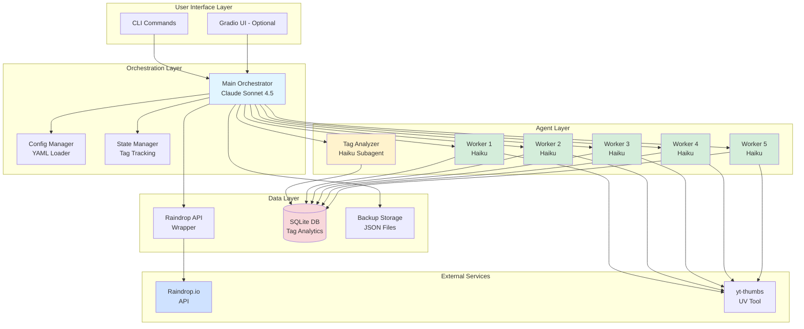

## 2. Processing Pipeline - Detailed Flow

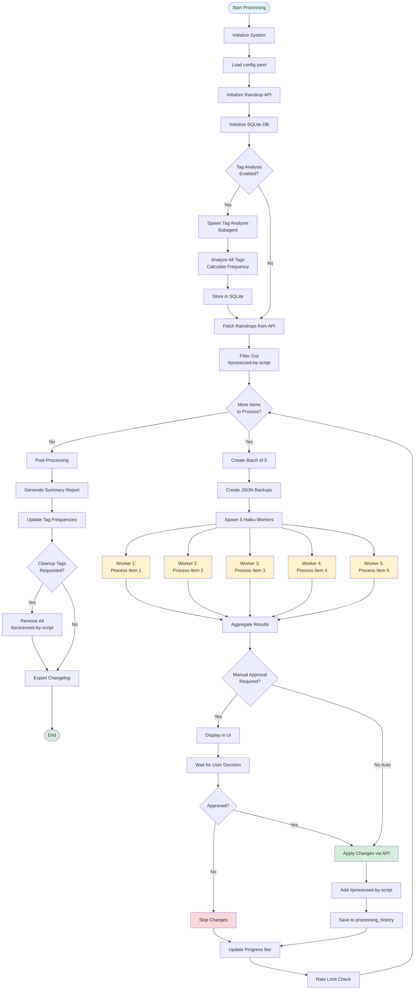

## 3. Worker Subagent Processing Logic

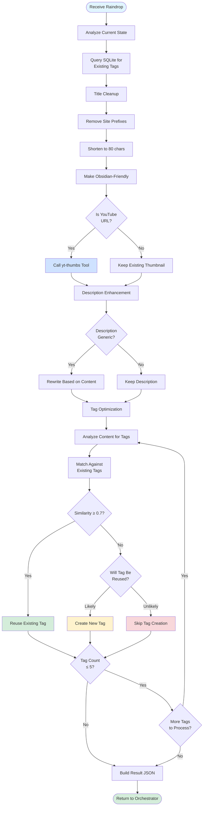

## 4. State Management & Resume Flow

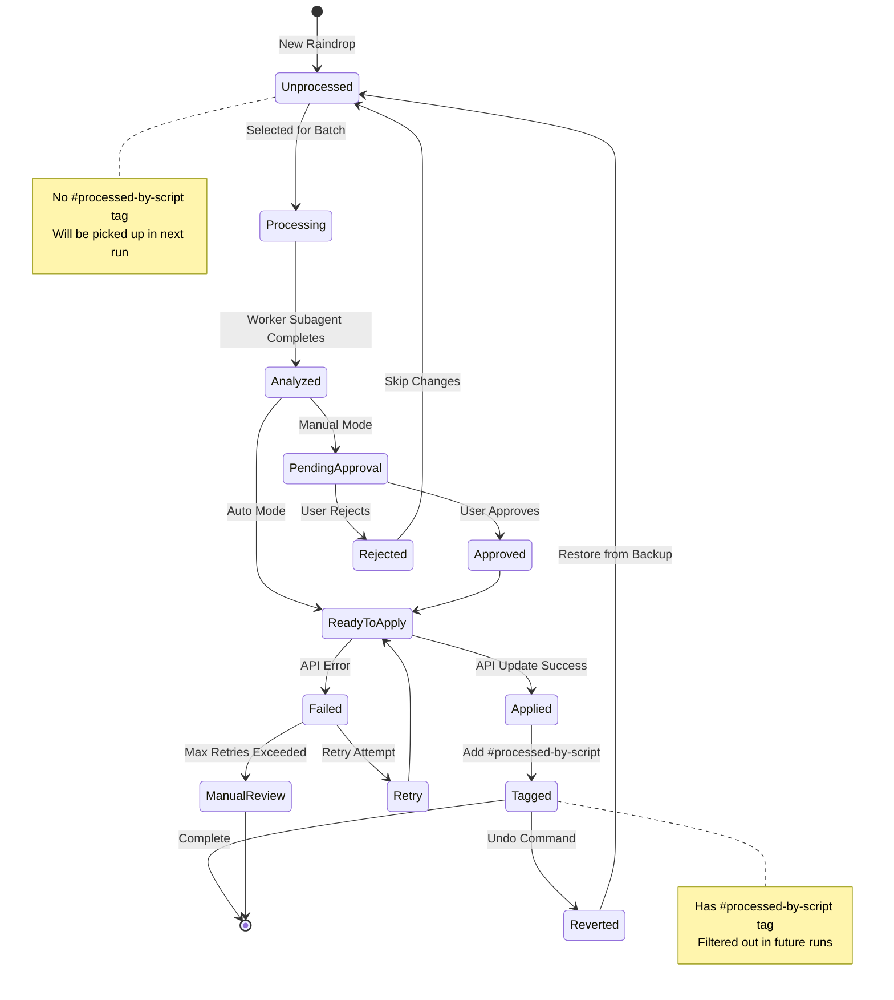

## 5. Data Flow Diagram

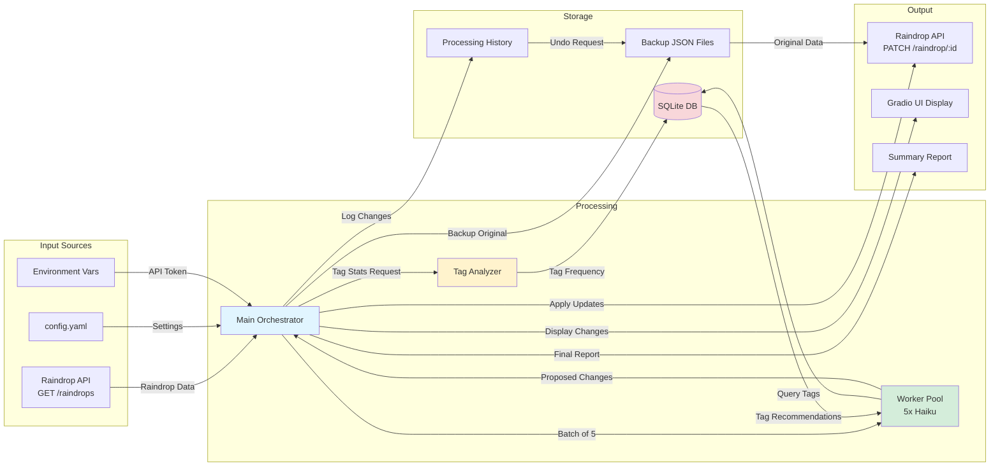

## 6. Gradio UI Navigation Flow

```mermaid
graph TD
    LAUNCH[Launch UI<br/>--ui flag] --> MAIN_APP[Gradio App]
    
    MAIN_APP --> TAB1[Tab 1: Processing]
    MAIN_APP --> TAB2[Tab 2: Tag Analytics]
    MAIN_APP --> TAB3[Tab 3: History]
    MAIN_APP --> TAB4[Tab 4: Settings]
    
    subgraph "Tab 1: Processing View"
        TAB1 --> LEFT[Left Panel:<br/>Current State]
        TAB1 --> RIGHT[Right Panel:<br/>Proposed Changes]
        LEFT --> TITLE_CUR[Title]
        LEFT --> DESC_CUR[Description]
        LEFT --> TAGS_CUR[Tags]
        LEFT --> THUMB_CUR[Thumbnail]
        RIGHT --> TITLE_NEW[Title ✨]
        RIGHT --> DESC_NEW[Description ✨]
        RIGHT --> TAGS_NEW[Tags ✨]
        RIGHT --> THUMB_NEW[Thumbnail ✨]
        TAB1 --> BUTTONS[Action Buttons]
        BUTTONS --> APPROVE[✓ Approve]
        BUTTONS --> REJECT[✗ Reject]
        BUTTONS --> APPROVE_ALL[✓✓ Approve All]
        TAB1 --> PROGRESS[Progress Bar<br/>15/50 - 30%]
    end
    
    subgraph "Tab 2: Tag Analytics"
        TAB2 --> FREQ_CHART[Frequency Bar Chart]
        TAB2 --> TAG_CLOUD[Tag Cloud]
        TAB2 --> ORPHANS[Orphan Tags List]
        TAB2 --> DUPLICATES[Potential Duplicates]
        TAB2 --> QUERY_INT[SQL Query Interface]
    end
    
    subgraph "Tab 3: History"
        TAB3 --> HISTORY_LIST[Processed Items List]
        HISTORY_LIST --> ITEM_DETAIL[Item Details]
        ITEM_DETAIL --> UNDO_BTN[Undo Button]
        TAB3 --> BULK_UNDO[Bulk Undo]
        TAB3 --> EXPORT_LOG[Export Changelog]
    end
    
    subgraph "Tab 4: Settings"
        TAB4 --> LIVE_CONFIG[Config Editor<br/>YAML]
        TAB4 --> SAVE_CONFIG[Save Changes]
        TAB4 --> TEST_CONN[Test API Connection]
        TAB4 --> VIEW_LOGS[View Logs]
    end

    style MAIN_APP fill:#e1f5ff
    style TAB1 fill:#d4edda
    style TAB2 fill:#fff3cd
    style TAB3 fill:#cfe2ff
    style TAB4 fill:#f8d7da
    style APPROVE fill:#d4edda
    style REJECT fill:#f8d7da
```

## 7. Cron Job Architecture (macOS)

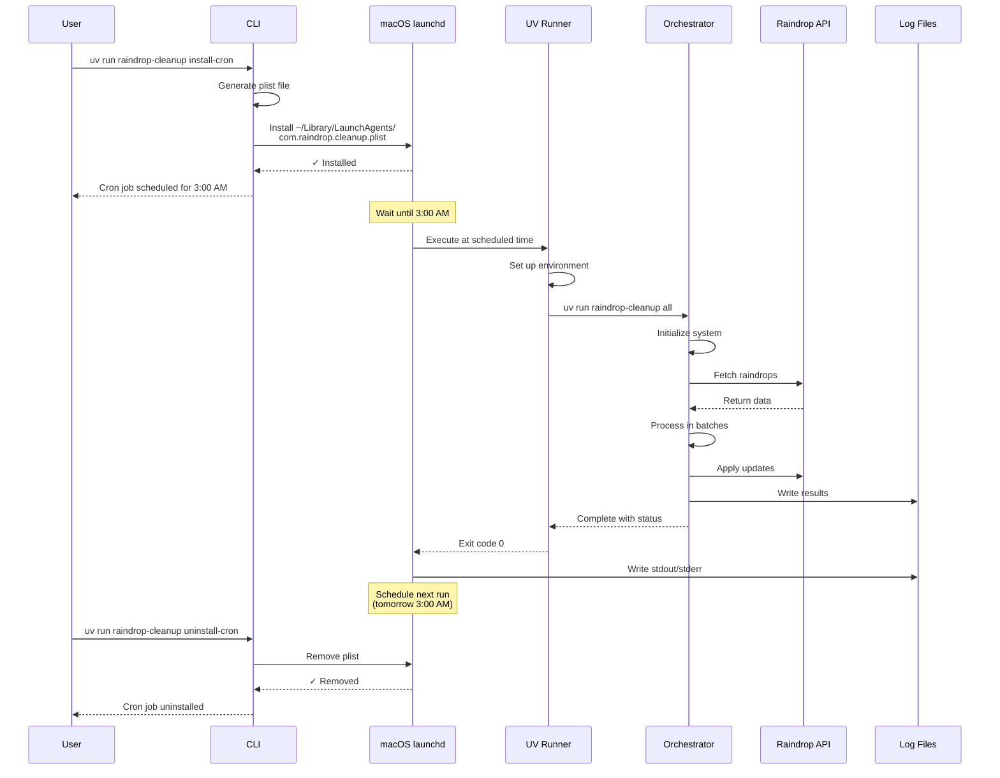

## 8. Error Handling & Recovery Flow

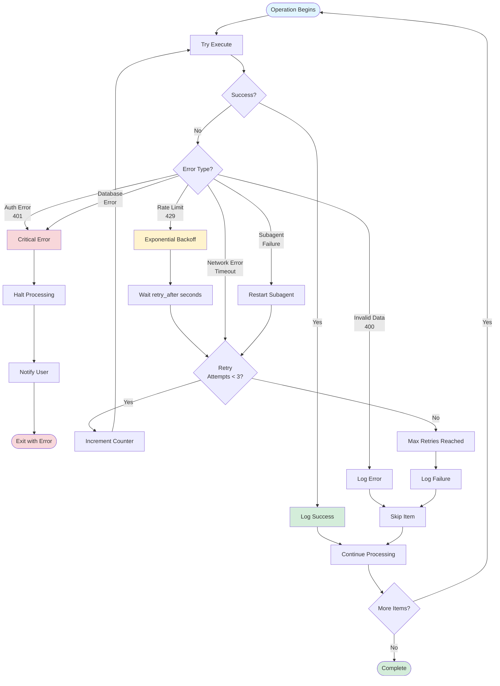

## 9. Undo/Rollback Mechanism

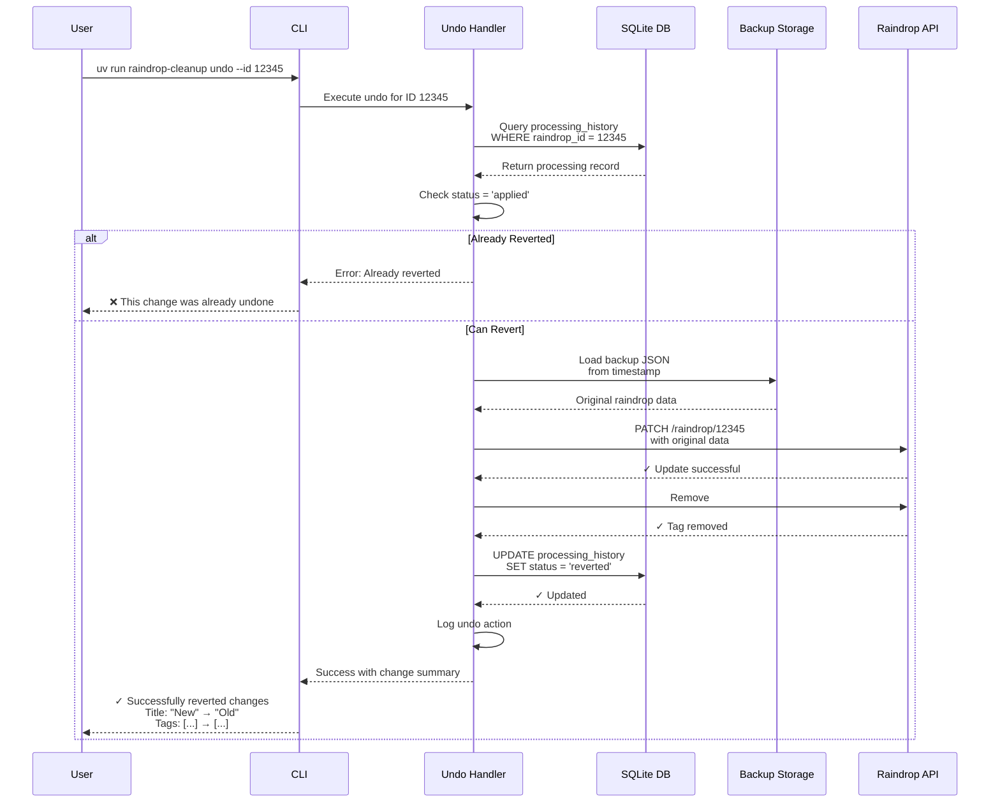

## 10. Tag Optimization Decision Tree

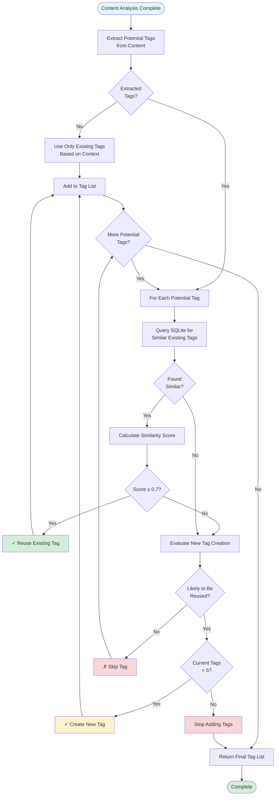

## 11. Demo Mode Flow

```mermaid
flowchart TD
    START([User Runs Demo Mode]) --> CMD[uv run raindrop-cleanup demo]
    CMD --> UI_FLAG{--ui Flag?}
    
    UI_FLAG -->|Yes| LAUNCH_UI[Launch Gradio Interface]
    UI_FLAG -->|No| CLI_MODE[CLI Mode]
    
    LAUNCH_UI --> UI_READY
    CLI_MODE --> UI_READY
    
    UI_READY[System Ready] --> FETCH_ALL[Fetch All Raindrops]
    FETCH_ALL --> RANDOM[Select 5 Random Items]
    RANDOM --> FILTER_PROC[Filter Out Already Processed]
    FILTER_PROC --> CHECK_COUNT{Got 5<br/>Items?}
    
    CHECK_COUNT -->|No| NEED_MORE[Need More Items]
    NEED_MORE --> RANDOM
    CHECK_COUNT -->|Yes| CREATE_BACKUP
    
    CREATE_BACKUP[Create Backup Directory<br/>./backups/demo_{timestamp}/] --> BACKUP_5[Backup All 5 Items to JSON]
    BACKUP_5 --> SHOW_BACKUP[Display Backup Location]
    SHOW_BACKUP --> SPAWN[Spawn 5 Haiku Workers]
    
    SPAWN --> P1[Process Item 1]
    SPAWN --> P2[Process Item 2]
    SPAWN --> P3[Process Item 3]
    SPAWN --> P4[Process Item 4]
    SPAWN --> P5[Process Item 5]
    
    P1 --> AGG[Aggregate All Results]
    P2 --> AGG
    P3 --> AGG
    P4 --> AGG
    P5 --> AGG
    
    AGG --> MANUAL{Manual<br/>Approval?}
    
    MANUAL -->|Yes UI| SHOW_UI[Display Side-by-Side<br/>in Gradio]
    SHOW_UI --> WAIT[Wait for User Review]
    WAIT --> APPROVE{User<br/>Approves?}
    
    MANUAL -->|Yes CLI| SHOW_CLI[Display in Terminal]
    SHOW_CLI --> PROMPT[Prompt for Approval]
    PROMPT --> APPROVE
    
    MANUAL -->|No Auto| APPLY_ALL[Apply All Changes]
    
    APPROVE -->|Yes| APPLY_ALL
    APPROVE -->|No| SKIP_ITEM[Skip This Item]
    SKIP_ITEM --> MORE_ITEMS{More Items<br/>in Demo?}
    MORE_ITEMS -->|Yes| SHOW_UI
    
    APPLY_ALL --> UPDATE_API[Update via Raindrop API]
    UPDATE_API --> ADD_TAG[Add #processed-by-script]
    ADD_TAG --> MORE_ITEMS
    MORE_ITEMS -->|No| SUMMARY
    
    SUMMARY[Generate Demo Summary] --> SHOW_SUMMARY[Show Results:<br/>- Applied: X/5<br/>- Skipped: Y/5<br/>- Backup Location<br/>- Undo Available]
    SHOW_SUMMARY --> TEST_UNDO{Want to Test<br/>Undo?}
    
    TEST_UNDO -->|Yes| UNDO_PROMPT[Prompt for Item ID]
    UNDO_PROMPT --> RUN_UNDO[Run Undo Command]
    RUN_UNDO --> VERIFY[Verify Restoration]
    VERIFY --> END
    
    TEST_UNDO -->|No| END([Demo Complete])

    style START fill:#e1f5ff
    style END fill:#d4edda
    style CREATE_BACKUP fill:#fff3cd
    style APPLY_ALL fill:#d4edda
    style SKIP_ITEM fill:#f8d7da
```

## 12. Rate Limiting Strategy

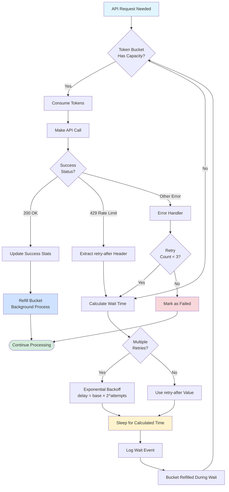